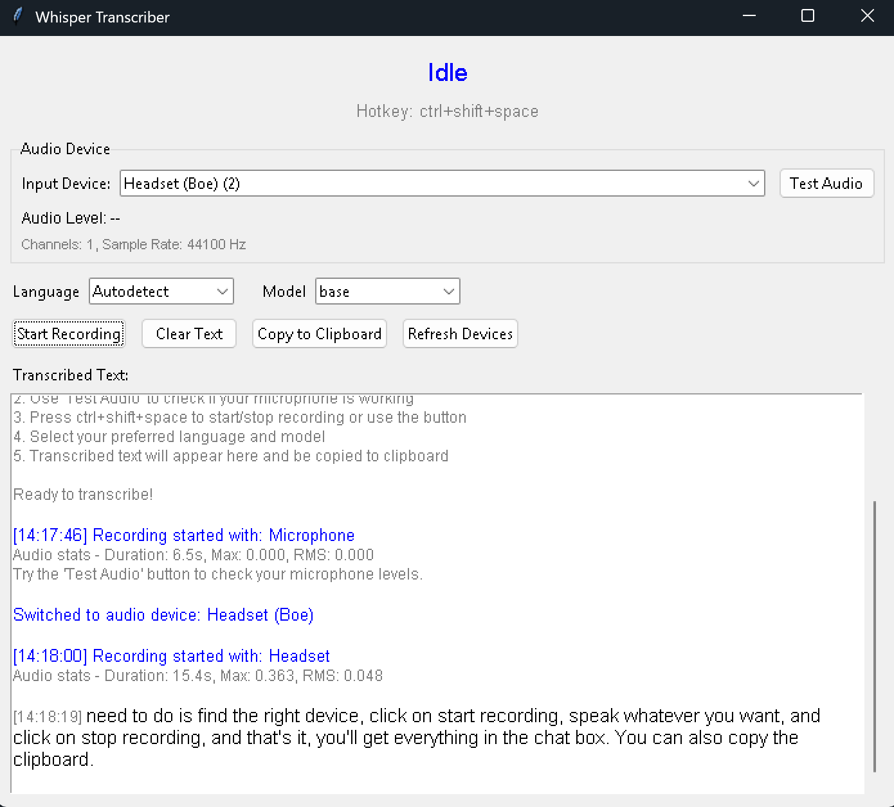

# 🎙️ Whisper Transcriber

A modern, feature-rich audio transcription application powered by OpenAI Whisper with real-time audio monitoring and intelligent state management.

## ✨ Features

- **Real-time Audio Testing**: Test your microphone with live audio level visualization
- **Multiple Audio Devices**: Select from all available input devices with detailed information
- **Global Hotkey Support**: Use `Ctrl+Shift+Space` to start/stop recording from anywhere
- **Multiple Whisper Models**: Choose from `tiny`, `base`, `small`, `medium`, `large` models
- **Language Selection**: Auto-detect or specify target language for better accuracy
- **Clean State Management**: No audio conflicts between testing and recording
- **Text History**: View all transcriptions with timestamps in a scrollable display
- **Clipboard Integration**: Automatic copying to clipboard with manual copy option
- **Professional UI**: Clean, modern interface with status indicators and error handling

## 🖼️ Application Demo



**What you see in the interface:**

1. **Status Bar** (top): Shows current state ("Idle") and global hotkey (`Ctrl+Shift+Space`)

2. **Audio Device Section**:
   - Device dropdown showing "Headset (Boe) (2)" - your selected microphone
   - Device info displaying "Channels: 1, Sample Rate: 44100 Hz"
   - "Test Audio" button for real-time microphone testing
   - Audio level indicator (shows "--" when not testing)

3. **Model Selection**:
   - **Language**: Set to "Autodetect" (or choose specific language)
   - **Model**: Set to "base" (balance of speed and accuracy)

4. **Control Buttons**:
   - `Start Recording`: Begin voice capture
   - `Clear Text`: Clear transcription history
   - `Copy to Clipboard`: Manually copy all text
   - `Refresh Devices`: Update audio device list

5. **Transcription Display**: Shows your complete session history including:
   - **Welcome message** with usage instructions
   - **Device switching** notifications (blue text)
   - **Recording sessions** with timestamps `[14:17:46]` and `[14:18:00]`
   - **Audio statistics** (Duration, Max level, RMS) for debugging
   - **Transcription results** showing your actual spoken words
   - **Error handling** suggestions when audio issues occur

## 📋 Requirements

- **Python**: 3.13 or higher
- **Operating System**: Windows, macOS, or Linux
- **Audio**: Working microphone/audio input device
- **CUDA** (optional): For GPU acceleration on NVIDIA cards

## 🚀 Installation

1. **Install uv** (if not already installed):

   ```bash
   # On Windows
   powershell -c "irm https://astral.sh/uv/install.ps1 | iex"
   
   # On macOS/Linux
   curl -LsSf https://astral.sh/uv/install.sh | sh
   ```

2. **Clone and setup**:

   ```bash
   git clone <your-repo-url>
   cd transcribe-whisper
   uv sync
   ```

3. **Run the application**:

   ```bash
   python main.py
   ```

That's it! The application will automatically download the required Whisper models on first use.

## 🎯 How It Works

### Step-by-Step Workflow

1. **Launch & Setup**:
   - Run `python main.py` to start the application
   - The app automatically detects your audio devices
   - Select your preferred microphone from the dropdown

2. **Test Your Audio** (Recommended):
   - Click "Test Audio" to verify your microphone
   - Speak normally and watch for audio level bars
   - This prevents "no audio detected" issues later

3. **Choose Your Settings**:
   - **Language**: Use "Autodetect" or specify your language
   - **Model**: `base` is good for most users (larger = more accurate but slower)

4. **Start Recording**:
   - **Method 1**: Press `Ctrl+Shift+Space` (works from any application)
   - **Method 2**: Click "Start Recording" button
   - Status changes to red "Listening..." when active

5. **Speak Your Content**:
   - Speak clearly and naturally
   - The app shows which device is recording
   - Press the hotkey or click "Stop Recording" when done

6. **Get Your Transcription**:
   - Status shows "Transcribing..." while processing
   - Your text appears with timestamp in the display area
   - Text is automatically copied to your clipboard
   - You can see audio quality stats for debugging

### Interface Features Explained

**Real-time Feedback**: The demo shows multiple recording sessions with timestamps, demonstrating how the app tracks your transcription history.

**Error Prevention**: Notice how the app shows audio statistics ("Duration: 6.5s, Max: 0.000") - this helps diagnose microphone issues before they become problems.

**Device Management**: The demo shows device switching notifications, proving the app handles audio device changes gracefully.

**Professional Output**: Each transcription includes timing, device info, and quality metrics - perfect for debugging and professional use.

## 🔧 Configuration

Customize the app by modifying `TranscriberConfig` in `main.py`:

```python
config = TranscriberConfig(
    hotkey="ctrl+alt+r",          # Change global hotkey
    default_model="large",         # Use larger model by default
    test_duration=3,              # Shorter audio tests
    min_recording_duration=1.0,   # Require longer recordings
)
```

## 🐛 Troubleshooting

**No audio detected?**

- Use "Test Audio" first - you should see level bars when speaking
- Check microphone permissions in your OS
- Try different devices from the dropdown
- Look for audio stats showing "Max: 0.000" (indicates silence)

**Poor transcription quality?**

- Use larger Whisper models (`small`, `medium`, `large`)
- Improve audio environment (quiet room, good microphone)
- Specify your language instead of auto-detect
- Check the audio statistics - low RMS values indicate poor audio

**App conflicts?**

- The modern architecture prevents audio device conflicts
- State management ensures testing and recording don't interfere
- Error messages in the text display guide you to solutions

## 📚 Technical Excellence

Built with modern Python architecture:

- **Pydantic models** for configuration and validation
- **Thread-safe audio operations** with proper locking
- **Clean state management** preventing conflicts
- **Type hints throughout** for better development experience
- **Modular design** for easy maintenance and extension

---

**Ready to transcribe? Just `uv sync` and `python main.py`!** 🎉
